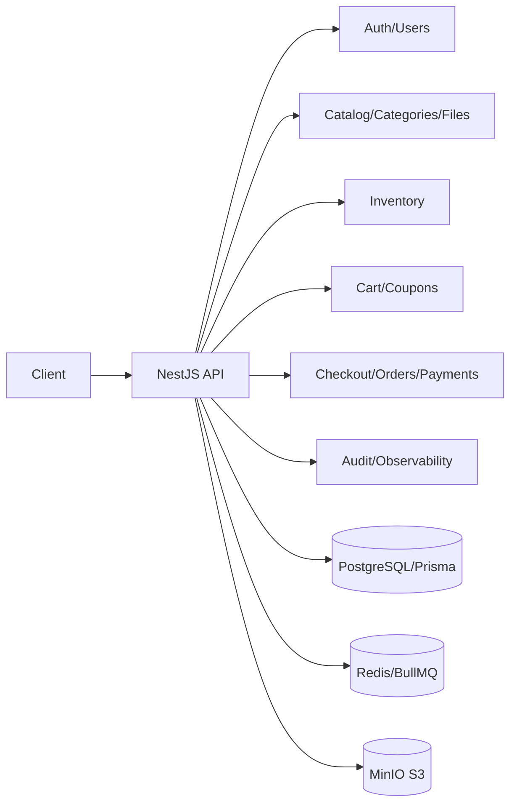
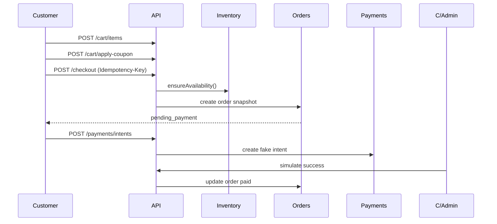

# Architecture

```mermaid
flowchart LR
  Client --> API[NestJS API]
  API --> Auth[Auth/Users]
  API --> Catalog[Catalog/Categories/Files]
  API --> Inv[Inventory]
  API --> Cart[Cart/Coupons]
  API --> Checkout[Checkout/Orders/Payments]
  API --> Audit[Audit/Observability]
  API --> DB[(PostgreSQL/Prisma)]
  API --> Redis[(Redis/BullMQ)]
  API --> S3[(MinIO S3)]
```

## Key Flow - Checkout

```mermaid
sequenceDiagram
  participant C as Customer
  participant A as API
  participant I as Inventory
  participant O as Orders
  participant P as Payments

  C->>A: POST /cart/items
  C->>A: POST /cart/apply-coupon
  C->>A: POST /checkout (Idempotency-Key)
  A->>I: ensureAvailability()
  A->>O: create order snapshot
  O-->>C: pending_payment
  C->>A: POST /payments/intents
  A->>P: create fake intent
  C/Admin->>A: simulate success
  A->>O: update order paid
```
